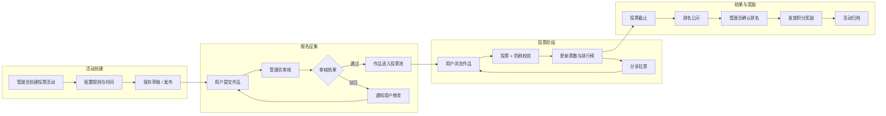

# 社区投票系统 · 产品需求文档

> **版本**：v1.1 &nbsp;|&nbsp; **负责人**：俊杰 &nbsp;|&nbsp; **更新**：2026-05-01 &nbsp;|&nbsp; **状态**：方案探索中

---

## 项目信息

| 字段 | 内容 |
|---|---|
| **产品名称** | 云芳邻 · 社区投票系统 |
| **版本定义** | v1.0 -- 投票活动引擎 + 作品报名 + 投票防刷 + 排行榜 + 奖励发放 |
| **核心目标** | 为社区提供"作品征集 - 大众投票 - 排名公示 - 奖励发放"的完整评选闭环，拉新促活 |
| **关联文档** | 《积分运营方案》、《积分任务系统 PRD》 |

### 版本日志

| 版本 | 日期 | 修改内容 | 负责人 |
|---|---|---|---|
| v1.0 | 2026-04-30 | 初版发布：活动生命周期、作品报名审核、投票核心、排行榜、奖励发放、订阅消息、数据模型 | 俊杰 |
| v1.1 | 2026-05-01 | 补充社区归属体系：活动报名/投票范围配置、作品社区归属、社区维度排名、社区资格校验、奖励分层（总排名奖+社区奖） | 俊杰 |

---

## 需求背景

- 社区居委定期举办书画展、才艺比赛、最美家庭评选等活动，目前缺乏线上化的投票评选工具，依赖线下纸质投票或第三方小程序，数据不留存，无法与云芳邻用户体系打通
- 云芳邻小程序需要更多互动玩法驱动用户活跃，投票评选是社区场景下参与门槛最低、传播效率最高的互动形式
- 现有积分体系缺少消耗场景之外的社交化获取路径，投票行为可作为新的积分获取触发点（复用积分任务系统的"参与投票"任务）

---

## 需求目标

| 目标类型 | 描述 | 衡量指标 |
|---|---|---|
| **社区运营** | 为居委提供可自助发起投票评选活动的工具，降低活动组织成本 | 每月活动创建数、活动完成率 |
| **用户活跃** | 通过作品征集 + 投票互动 + 分享拉票，带动小程序访问和用户增长 | 活动参与人数、分享转化率、新用户注册数 |
| **积分联动** | 投票行为纳入积分任务体系，投票奖积分 + 活动奖励积分发放 | 投票积分发放量、活动奖励发放量 |

---

## 业务流程总览

> 以下流程图展示投票活动的完整生命周期，用于评审时快速建立整体认知。

---

## 功能模块总览

| 模块 | 端 | 页面/功能 | 状态 |
|---|---|---|---|
| 活动列表 | C端 | 投票活动列表、分类筛选、状态标签 | 已设计 |
| 活动详情 | C端 | 活动信息、候选作品列表、投票操作、排行榜 | 已设计 |
| 作品报名 | C端 | 报名表单、图片/视频上传、提交审核 | 已设计 |
| 作品详情 | C端 | 图片/视频浏览、作品介绍、投票操作 | 已设计 |
| 我的投票 | C端 | 我的投票记录、我的参赛作品 | 已设计 |
| 分享海报 | C端 | Canvas 生成活动/作品海报，含小程序码 | 已设计 |
| 订阅消息 | C端 | 新增投票相关子开关（3项通知） | 已设计 |
| 活动管理 | PC端 | 活动CRUD、规则配置、状态流转 | 已设计 |
| 作品审核 | PC端 | 报名作品列表、审核操作 | 已设计 |
| 投票数据 | PC端 | 数据面板、投票明细、异常处理、Excel导出 | 已设计 |
| 奖励发放 | PC端 | 按排名发放积分、发放记录 | 已设计 |

---

## C端 · 投票活动列表页

<!-- prototype: src="prototype/vote-list.html" width="375" height="812" scale="0.85" title="C端原型 · 投票活动列表" -->

#### 功能描述

### 1. 页面结构

- 顶部：页面标题「社区投票」+ 搜索图标
- 分类筛选栏：全部 / 作品展 / 才艺比赛 / 话题投票 / 最美评选
  - 选中态：加粗 + 蓝色下划线
  - 分类由后台字典管理，支持动态扩展
  - 滚动时吸顶固定
- 活动卡片列表：按活动状态排序展示

### 2. 活动卡片结构

每张卡片包含：

- **封面图**：宽度撑满卡片，高度 180px，圆角裁切
- **状态标签**：覆盖在封面图右上角
  - [报名中]（蓝色）、[投票中]（绿色）、[公示中]（橙色）、[已结束]（灰色）
- **社区/范围标签**：覆盖在封面图左上角
  - 本社区活动：显示社区名称（如"芳和花园"），浅蓝底白字胶囊
  - 跨社区活动：显示上级组织名称（如"XX街道"），紫色底白字胶囊
  - 全平台活动：显示"全区活动"，橙色底白字胶囊
- **标题行**：活动名称（16px加粗，最多两行溢出省略）
- **信息行**：
  - 投票时间段（灰色小字）
  - 参与人数 + 总票数（灰色小字）
- **底部操作区**：
  - [报名中]：显示「我要报名」蓝色文字按钮
  - [投票中]：显示「去投票」蓝色填充按钮
  - [公示中] / [已结束]：显示「查看结果」灰色文字按钮

### 2.1 活动列表数据范围

用户打开活动列表时，默认展示以下范围的活动：

- 用户所属社区发起的活动
- 用户所属社区被纳入投票范围的跨社区活动
- 全平台活动

不展示用户不在投票范围内的其他社区活动。

### 3. 入口

- 首页金刚区：新增「社区投票」入口图标，点击跳转本页面
- 首页信息流：有进行中的投票活动时，在活动列表中展示推荐卡片
- 个人中心：「我的投票」入口（见【我的投票页】）

### 4. 排序规则

1. 投票中（最前，引导参与）
2. 报名中（引导报名）
3. 公示中（查看结果）
4. 已结束（最后）

同状态内按创建时间倒序。

### 5. 异常与边界

| 场景 | 处理方式 |
|---|---|
| 无任何活动 | 空状态插画 + 文案"暂无投票活动" |
| 搜索无结果 | 空状态插画 + 文案"未找到相关活动" |
| 活动数量多 | 分页加载，每页10条，上拉加载更多 |

---

## C端 · 活动详情与投票页

<!-- prototype: src="prototype/vote-detail.html" width="375" height="812" scale="0.85" title="C端原型 · 活动详情与投票" -->

#### 功能描述

### 1. 页面结构

- **头部区域**：
  - 封面图（全宽，高度 200px）
  - 活动标题（20px加粗，白色文字叠加在封面图底部渐变遮罩上）
- **统计面板**（白色卡片，负 margin 上移与封面衔接）：
  - 三项数据横排：参与人数 / 累计票数 / 浏览量
  - 每项：数字（24px加粗蓝色）+ 标签（12px灰色）
- **倒计时条**：
  - [报名中]：「距报名截止 X天X时X分」
  - [投票中]：「距投票结束 X天X时X分」
  - [公示中]：「公示期至 YYYY-MM-DD」
  - [已结束]：「活动已结束」灰色文字
  - 秒级更新
- **活动范围提示条**（倒计时条下方）：
  - 本社区活动：「仅限 芳和花园 居民参与」蓝色文字
  - 跨社区活动：「XX街道 辖区居民均可参与」紫色文字
  - 全平台活动：「全区居民均可参与」橙色文字
  - 用户不在投票范围内时：「本活动仅限 XX 居民投票，您可浏览但无法投票」灰色提示条
- **活动简介**：可展开/收起的描述文字 + 投票规则说明
- **Tab 切换栏**：按编号 / 按票数 / 社区排名（跨社区/全平台活动时显示第三个 Tab）
  - 滚动时吸顶固定
- **候选作品列表**：双列卡片布局

### 2. 候选作品卡片

双列瀑布流布局，每张卡片包含：

- **作品图片**：首图展示，宽度撑满半列
- **编号标签**：左上角圆角标签，如"01号"
- **社区标签**：跨社区/全平台活动时，图片右下角显示作品所属社区名称（半透明黑底白字小标签）；本社区活动不显示
- **作品名称**：14px加粗，最多两行
- **当前票数**：橙色数字 + "票"字
- **投票按钮**：
  - 可投票：蓝色「投票」按钮
  - 今日已投：灰色「已投票」按钮
  - 全程已投：灰色「已投票」按钮
  - 不在投票范围：灰色「仅限XX居民」按钮，不可点击
  - 活动非投票中：不显示按钮
- **最近投票人头像组**：底部展示最近 3 位投票用户的小头像（24px圆形），超过 3 位显示"+N"

### 3. 投票交互流程

用户点击作品卡片上的「投票」按钮：

1. 系统执行防刷校验链（详见【核心业务流程】）
2. 校验通过 → 弹出 Toast："投票成功！"
   - 按钮变为灰色「已投票」
   - 票数 +1（即时更新，无需刷新页面）
   - 最近投票人头像组更新
   - 弹出分享引导浮层："分享给朋友一起投票吧"（3秒自动消失，非强制）
3. 校验不通过 → 弹出 Toast 提示原因：
   - "本活动仅限XX居民投票"（社区资格不符）
   - "今日投票次数已用完，明天再来吧"
   - "您已对该作品投过票"
   - "请先绑定手机号"（跳转手机号绑定页）
   - "投票尚未开始"
   - "投票已结束"

### 4. Tab 切换

| Tab | 排序方式 | 显示条件 |
|---|---|---|
| 按编号 | 按作品编号升序（管理员在后台设定的编号） | 始终显示 |
| 按票数 | 全部作品按当前票数降序，票数相同按编号升序 | 始终显示 |
| 社区排名 | 按当前用户所属社区筛选，仅显示本社区作品并按票数排序 | 仅跨社区/全平台活动显示 |

按编号/按票数切换时前端排序即可，社区排名需前端按 `community_id` 筛选。

### 5. 排行榜展示

**按票数 Tab**（总排名）：

- 前三名：卡片左上角叠加金/银/铜奖牌图标
- 其余：显示名次数字
- 相同票数同名次

**社区排名 Tab**（跨社区/全平台活动）：

- 顶部展示「社区贡献榜」卡片：各参与社区按总票数排序，横向滚动展示前 5 名社区（社区名 + 总票数 + 参与作品数）
- 下方作品列表：仅展示当前用户所属社区的作品，按票数排序，显示社区内名次
- 社区贡献榜可激发社区间良性竞争，鼓励居民为本社区作品拉票

[公示中] 和 [已结束] 状态下，默认展示"按票数"Tab，突出最终排名。

### 6. 报名入口

- [报名中] 状态下，页面底部 fixed 操作栏显示「我要报名」按钮（蓝色填充，全宽）
- 点击跳转【作品报名提交页】
- 用户已提交过报名时，按钮变为「已报名，查看状态」灰色按钮，点击跳转【我的投票 - 我的参赛】

### 7. 分享功能

- 右上角分享按钮：
  - 「分享好友」：生成小程序分享卡片（封面图 + 活动标题 + "快来投票"文案）
  - 「生成海报」：Canvas 绘制活动海报（封面图 + 标题 + 统计数据 + 小程序码），可保存相册
- 分享卡片点击直接进入活动详情页

### 8. 异常与边界

| 场景 | 处理方式 |
|---|---|
| 活动无候选作品 | 空状态 + 文案"暂无参赛作品" |
| 投票接口异常 | Toast "网络异常，请稍后重试"，按钮状态不变 |
| 活动被管理员暂停 | 进入页面时 Toast "活动已暂停"，投票按钮全部禁用 |

---

## C端 · 作品详情页

<!-- prototype: src="prototype/vote-item-detail.html" width="375" height="812" scale="0.85" title="C端原型 · 作品详情" -->

#### 功能描述

### 1. 页面结构

- **图片/视频区**：
  - 多图时为 Swiper 轮播，底部圆点指示器
  - 有视频时视频放第一帧，支持全屏播放
  - 图片支持点击放大预览
- **作品信息区**：
  - 编号 + 作品名称（20px加粗）
  - 当前票数（橙色大字 + "票"标签）+ 总排名（灰色"第N名"）
  - 社区内排名（跨社区/全平台活动时显示）：灰色小字"社区内第1名 · 芳和花园"
  - 作品介绍（多行文本，富文本支持）
  - 参赛者：报名者姓名 + 所属社区名称（跨社区/全平台活动时显示）
- **底部操作栏**（fixed）：
  - 左侧：票数 + 排名信息
  - 右侧：「投票」按钮（交互同活动详情页）
  - [公示中] / [已结束]：不显示投票按钮，仅展示最终排名
- **分享按钮**：右上角，生成作品专属海报（作品图 + 名称 + 编号 + 小程序码）

### 2. 最近投票记录

作品信息区下方，展示最近 10 条投票记录：

- 每条：投票人头像 + 昵称 + 投票时间（如"3分钟前"）
- 增强社区氛围感，邻居看到邻居投了票

---

## C端 · 作品报名提交页

<!-- prototype: src="prototype/vote-enroll.html" width="375" height="812" scale="0.85" title="C端原型 · 作品报名" -->

#### 功能描述

### 1. 表单字段

| 字段 | 控件类型 | 规则 |
|---|---|---|
| [作品名称] | 文本输入 | 必填，最多 30 字 |
| [作品介绍] | 文本域 | 必填，最多 500 字 |
| [作品图片] | 图片上传 | 必填，最少 1 张，最多 9 张，每张不超过 10MB |
| [作品视频] | 视频上传 | 选填，最多 1 个，不超过 50MB，时长不超过 3 分钟 |
| [参赛者姓名] | 文本输入 | 必填，最多 20 字 |
| [联系电话] | 文本输入 | 必填，自动填充当前用户手机号，可修改 |
| [所属社区] | 只读展示 | 自动从当前用户信息带入，不可修改 |
| [分组/类别] | 下拉选择 | 活动配置了分组时显示，否则隐藏 |

### 2. 内容安全审核

- 图片上传后调用微信 `imgSecCheck` 接口进行安全检测
- 文字提交时调用微信 `msgSecCheck` 接口
- 检测不通过时 Toast 提示："内容包含违规信息，请修改后重新提交"

### 3. 提交流程

用户点击「提交报名」：

1. 前端表单校验（必填项、字数、图片数量）
2. 内容安全检测
3. 提交成功 → 跳转成功页
   - 成功页文案："报名已提交，等待审核"
   - 提示预计审核时间："通常 1-2 个工作日内完成审核"
   - 按钮：「查看我的报名」→ 跳转【我的投票 - 我的参赛】
4. 系统发送订阅消息通知管理员有新报名待审核

### 4. 重复报名限制

- 同一用户在同一活动中只能提交一个作品
- 已提交过的用户进入本页时，自动跳转到已提交的作品详情，并提示"您已报名此活动"
- 被驳回的作品支持修改后重新提交（如活动仍在报名中）

---

## C端 · 我的投票页

<!-- prototype: src="prototype/my-votes.html" width="375" height="812" scale="0.85" title="C端原型 · 我的投票" -->

#### 功能描述

### 1. 页面结构

- Tab 切换栏：我的投票 / 我的参赛
- 列表区域

### 2. 我的投票 Tab

展示当前用户参与过投票的活动列表：

- 每张卡片：活动封面缩略图（80x60） + 活动标题 + 我投了 N 票 + 活动状态标签
- 按投票时间倒序
- 点击进入活动详情页
- 分页加载，每页 20 条

### 3. 我的参赛 Tab

展示当前用户提交过报名的活动列表：

- 每张卡片：作品首图缩略图 + 作品名称 + 审核状态标签 + 票数（审核通过后显示）
- 审核状态标签：
  - [待审核]（橙色）
  - [已通过]（绿色）+ 当前票数和排名
  - [已驳回]（红色）+ 驳回原因（灰色小字展示）
- 点击进入作品详情页
- [已驳回] 的作品，若活动仍在报名中，显示「修改并重新提交」蓝色文字按钮

### 4. 入口

- 个人中心功能宫格：新增「我的投票」入口项
  - 图标：蓝色投票手势样式
  - 当有待查看的审核结果（通过/驳回）时，右上角显示小红点

---

## PC端 · 投票活动管理

<!-- prototype: src="prototype/vote-admin.html" width="1920" height="1080" scale="0.35" title="PC端原型 · 投票活动管理" -->

#### 功能描述

### 1. 列表页

- **筛选区**：支持按[活动名称]（模糊搜索）、[活动状态]（下拉：全部/草稿/报名中/投票中/公示中/已结束/已归档）、[活动分类]（下拉）、[发起社区]（下拉，来自组织树）、[创建时间]（日期范围）组合筛选
- **操作栏**：「创建活动」蓝色按钮
- **表格列**：

| 列名 | 说明 |
|---|---|
| [活动名称] | 活动标题，溢出省略 |
| [活动分类] | 作品展/才艺比赛/话题投票/最美评选 |
| [发起社区] | 创建活动的管理员所属社区名称 |
| [活动范围] | 本社区 / 跨社区(N个) / 全平台 |
| [活动状态] | 标签样式：草稿(灰)、报名中(蓝)、投票中(绿)、公示中(橙)、已结束(灰)、已归档(浅灰) |
| [报名时间] | 起止时间段，未配置显示"-" |
| [投票时间] | 起止时间段 |
| [候选作品数] | 已通过审核的作品数量 |
| [总票数] | 累计收到的有效票数 |
| [创建时间] | 格式 YYYY-MM-DD HH:mm |
| [操作] | 根据状态动态展示操作按钮 |

- **行内操作**（按活动状态动态展示）：

| 状态 | 可用操作 |
|---|---|
| [草稿] | 「编辑」「发布」「删除」 |
| [报名中] | 「编辑」「查看作品」「开启投票」 |
| [投票中] | 「查看数据」「暂停投票」 |
| [公示中] | 「查看数据」「结束公示」 |
| [已结束] | 「查看数据」「发放奖励」「归档」 |
| [已归档] | 「查看数据」 |

- **分页**：默认每页 10 条

### 2. 创建/编辑活动弹窗

弹窗标题：「创建投票活动」/「编辑投票活动」

**基本信息区**：

| 字段 | 控件类型 | 规则说明 |
|---|---|---|
| [活动名称] | 文本输入 | 必填，最多 50 字 |
| [活动分类] | 下拉选择 | 必填，选项来自后台字典 |
| [封面图] | 图片上传 | 必填，建议尺寸 750x400px |
| [活动描述] | 富文本编辑器 | 必填，支持图文混排 |

**活动范围区**：

| 字段 | 控件类型 | 规则说明 |
|---|---|---|
| [报名范围] | 单选组 | 本社区 / 指定社区 / 全平台。默认"本社区"，选择"指定社区"时展开社区选择器 |
| [报名社区列表] | 组织树多选 | 报名范围为"指定社区"时显示，从组织树中勾选允许报名的社区节点 |
| [投票范围] | 单选组 | 本社区 / 指定社区 / 全平台。默认与报名范围一致，可单独设置 |
| [投票社区列表] | 组织树多选 | 投票范围为"指定社区"时显示 |

> 说明：报名范围和投票范围可以不同。典型场景：仅本社区居民可报名参赛，但全平台用户均可投票（扩大传播范围）。社区管理员只能选择自己管辖的社区节点，超级管理员可选择全部节点。

**时间配置区**：

| 字段 | 控件类型 | 规则说明 |
|---|---|---|
| [开放报名] | 开关 | 默认开启；关闭后隐藏报名时间，管理员手动添加候选作品 |
| [报名时间] | 日期时间范围 | 开放报名时必填 |
| [投票时间] | 日期时间范围 | 必填，开始时间须晚于报名截止时间 |
| [公示天数] | 数字输入 + "天"后缀 | 必填，默认 3 天，投票结束后自动进入公示期 |

**投票规则区**：

| 字段 | 控件类型 | 规则说明 |
|---|---|---|
| [投票方式] | 单选组 | 单选 / 多选（选择多选时展开最多选几项输入框） |
| [投票模式] | 单选组 | 每日可投 / 全程可投 |
| [每日票数上限] | 数字输入 | 投票模式为"每日可投"时必填，默认 5 |
| [全程票数上限] | 数字输入 | 投票模式为"全程可投"时必填，默认 10 |
| [单作品每日限投] | 数字输入 | 默认 1，即每人每天对同一作品最多投 1 票 |
| [是否显示实时票数] | 开关 | 默认开启；关闭后 C 端隐藏票数，投票结束后公示时再显示 |
| [是否需要手机号] | 开关 | 默认关闭；开启后用户必须绑定手机号才能投票 |

**分组配置区**（可选）：

- 「添加分组」按钮，支持添加多个分组（如"书法组"、"绘画组"）
- 每个分组：分组名称输入框 + 删除按钮
- 分组用于 C 端候选作品的分类展示和独立排名

**奖励配置区**（可选）：

| 字段 | 控件类型 | 规则说明 |
|---|---|---|
| [启用奖励] | 开关 | 默认关闭 |
| [总排名奖励] | 动态表格 | 启用后展开，可添加多行：名次范围（如"第1名"/"第2-3名"/"第4-10名"）+ 奖励积分值 |
| [启用社区内奖励] | 开关 | 仅跨社区/全平台活动时显示。开启后展开社区内排名奖配置 |
| [社区内排名奖励] | 动态表格 | 每个社区内部排名的奖励，如"社区第1名 50积分"。所有社区共用同一套规则 |

**操作按钮**：
- 「保存草稿」：保存但不发布
- 「发布」：校验必填项后发布，状态变为[报名中]（若开放报名）或直接等待投票开始时间
- 「取消」：关闭弹窗

### 3. 发布确认

点击「发布」时弹出二次确认：
- 标题："确认发布此投票活动？"
- 说明文案："发布后活动将对C端用户可见，报名时间和投票时间到达后将自动开启对应阶段。"
- 按钮：「取消」+「确定发布」

### 4. 状态流转操作确认

所有状态变更操作均需二次确认弹窗：

| 操作 | 确认标题 | 说明文案 |
|---|---|---|
| 「开启投票」 | 确认开启投票？ | 开启后将关闭报名入口，进入投票阶段。当前有 N 个作品通过审核，M 个待审核。 |
| 「暂停投票」 | 确认暂停投票？ | 暂停后C端用户将无法继续投票，可随时恢复。 |
| 「结束公示」 | 确认结束公示期？ | 结束后活动将进入已结束状态，可进行奖励发放。 |
| 「归档」 | 确认归档此活动？ | 归档后活动移入历史记录，不再展示在活动列表前列。 |
| 「删除」 | 确认删除此活动？ | 删除后活动将不再展示，已有的报名和投票数据会保留。 |

> 删除为软删除，数据保留不物理删除。

---

## PC端 · 作品审核管理

<!-- prototype: src="prototype/vote-audit.html" width="1920" height="1080" scale="0.35" title="PC端原型 · 作品审核" -->

#### 功能描述

### 1. 入口

从活动列表行内操作「查看作品」进入，页面标题显示关联的活动名称。

### 2. 列表页

- **筛选区**：支持按[作品名称]（模糊搜索）、[参赛者姓名]（模糊搜索）、[审核状态]（下拉：全部/待审核/已通过/已驳回）、[分组]（下拉，活动配置了分组时显示）组合筛选
- **操作栏**：
  - 「手动添加作品」蓝色按钮（管理员直接添加候选作品，无需用户报名）
  - 「批量通过」按钮（勾选多条后可见）
- **表格列**：

| 列名 | 说明 |
|---|---|
| [勾选框] | 批量操作勾选 |
| [作品图片] | 首图缩略图（80x60） |
| [编号] | 审核通过后分配的展示编号，待审核/已驳回显示"-" |
| [作品名称] | 溢出省略 |
| [分组] | 所属分组，未配置分组时隐藏此列 |
| [所属社区] | 报名者所属社区名称 |
| [参赛者] | 报名者姓名 |
| [联系电话] | 脱敏显示 |
| [审核状态] | 标签样式：待审核(橙)、已通过(绿)、已驳回(红) |
| [提交时间] | 格式 YYYY-MM-DD HH:mm |
| [票数] | 已通过作品的当前票数，其他状态显示"-" |
| [操作] | 「查看」「通过」「驳回」 |

- **行内操作**：
  - 「查看」：打开作品详情弹窗（图片/视频大图预览 + 报名信息）
  - 「通过」：二次确认后，作品状态变为[已通过]，自动分配编号，系统发送审核通过通知
  - 「驳回」：弹出驳回原因输入框（必填），确认后状态变为[已驳回]，系统发送驳回通知
- **分页**：默认每页 20 条

### 3. 编号分配规则

- 按审核通过的时间顺序自动递增分配（01、02、03...）
- 活动配置了分组时，每个分组独立编号（书法组-01、书法组-02、绘画组-01...）
- 编号一旦分配不可变更

---

## PC端 · 投票数据与奖励

<!-- prototype: src="prototype/vote-data.html" width="1920" height="1080" scale="0.35" title="PC端原型 · 投票数据" -->

#### 功能描述

### 1. 入口

从活动列表行内操作「查看数据」进入。

### 2. 数据概览面板

页面顶部四项统计卡片横排：

| 指标 | 说明 |
|---|---|
| 参与人数（UV） | 参与投票的独立用户数 |
| 累计票数 | 有效投票总数（已扣除冻结票数） |
| 候选作品数 | 已通过审核的作品数量 |
| 今日新增票数 | 当日 0 点以来的新增票数 |

### 2.1 社区参与统计（跨社区/全平台活动时显示）

概览面板下方展示各社区参与情况对比表：

| 列名 | 说明 |
|---|---|
| [社区名称] | 参与的社区 |
| [参赛作品数] | 该社区提交的已通过作品数 |
| [获得票数] | 该社区所有作品的有效票数合计 |
| [投票人数] | 该社区居民参与投票的人数 |
| [社区第一名] | 该社区票数最高的作品名称 + 票数 |

支持按获得票数降序排列，可快速了解各社区参与热度和竞争态势。

### 3. 排名列表

- **筛选区**：支持按[作品名称]（模糊搜索）、[分组]（下拉）、[所属社区]（下拉，跨社区/全平台活动时显示）排序
- **操作栏**：「导出Excel」按钮 -- 导出当前排名数据
- **表格列**：

| 列名 | 说明 |
|---|---|
| [排名] | 按票数降序的排名，相同票数同名次 |
| [作品图片] | 首图缩略图 |
| [编号] | 作品编号 |
| [作品名称] | 溢出省略 |
| [所属社区] | 作品报名者的所属社区 |
| [分组] | 所属分组 |
| [参赛者] | 报名者姓名 |
| [社区内排名] | 该作品在其所属社区内的排名（跨社区/全平台活动时显示此列） |
| [有效票数] | 当前有效票数 |
| [冻结票数] | 被管理员冻结的可疑票数 |
| [奖励积分] | 该名次对应的奖励积分值，未配置奖励显示"-" |
| [发放状态] | 未发放(灰) / 已发放(绿) / 不适用（无奖励配置） |
| [操作] | 「投票明细」「冻结票数」「发放奖励」 |

### 4. 投票明细弹窗

点击「投票明细」打开弹窗，展示该作品收到的所有投票记录：

| 列名 | 说明 |
|---|---|
| [投票用户] | 用户姓名 |
| [手机号] | 脱敏显示 |
| [所属社区] | 用户所属社区 |
| [投票时间] | 格式 YYYY-MM-DD HH:mm:ss |
| [投票IP] | IP 地址 |
| [状态] | 有效(绿) / 已冻结(红) |
| [操作] | 「冻结」/「恢复」 |

- 支持按时间范围筛选、按 IP 搜索
- 分页，默认每页 50 条

### 5. 批量冻结票数

管理员发现刷票嫌疑时：

- 点击「冻结票数」弹出操作弹窗
- 可按条件批量冻结：按 IP 地址冻结 / 按时间段冻结
- 冻结后：
  - 该作品有效票数减少
  - 排名自动重算
  - 冻结操作记录在审计日志中
  - 冻结的投票记录状态变为[已冻结]，但数据保留不删除

### 6. 奖励发放

活动进入[已结束]状态后可操作：

- 单个发放：在排名列表中点击「发放奖励」，二次确认后发放积分到该参赛者账户
- 批量发放：勾选多个作品后点击「批量发放」，弹出确认弹窗展示发放清单
- 发放时调用积分管道接口，按活动配置的奖励规则对应积分值
- 跨社区/全平台活动如开启了[社区内排名奖励]，需分别发放：总排名奖 + 社区内排名奖，两者可叠加（如一个作品既是总排名第1又是社区内第1，两笔奖励都发）
- 发放成功后：
  - [发放状态]变为"已发放"
  - 系统发送订阅消息通知参赛者
  - 积分流水备注为"投票活动奖励-{活动名称}"
  - 积分支出方为平台
- 已发放的奖励不可撤销

---

## 订阅消息

<!-- prototype: src="prototype/notification-settings.html" width="375" height="812" scale="0.85" title="C端原型 · 消息订阅设置" -->

#### 功能描述

复用云芳邻已有的微信长期订阅消息能力（总开关 + 业务子开关 + 统一长期订阅模板），本版本新增「投票活动」业务子开关，覆盖 3 类通知场景。

### 1. 新增子开关

- **位置**：【消息订阅设置】页，业务子开关分类下
- **名称**：投票活动（3 项）
- **默认状态**：用户首次进入时默认开启
- **关闭后**：不再向该用户推送投票相关通知
- **子项**：
  - 【投票活动】作品审核结果通知
  - 【投票活动】活动状态变更通知
  - 【投票活动】活动奖励到账通知

### 2. 作品审核结果通知

**触发事件**

管理员在后台对用户提交的参赛作品执行审核操作（通过或驳回）时触发。

**模板字段填充**

审核通过时：

| 字段 | 内容 |
|---|---|
| 社区通知 | 作品审核通知 |
| 通知内容 | 您在「{活动名称}」提交的作品「{作品名称}」已通过审核，快去邀请好友投票吧 |
| 通知时间 | 审核操作时间，格式 YYYY-MM-DD HH:mm |
| 提示说明 | 点击查看作品详情 |

审核驳回时：

| 字段 | 内容 |
|---|---|
| 社区通知 | 作品审核通知 |
| 通知内容 | 您在「{活动名称}」提交的作品「{作品名称}」未通过审核，原因：{驳回原因} |
| 通知时间 | 审核操作时间，格式 YYYY-MM-DD HH:mm |
| 提示说明 | 点击查看详情并修改 |

**落地页**

- 审核通过：点击跳转作品详情页
- 审核驳回：点击跳转【我的投票 - 我的参赛】，用户可修改后重新提交

**频次控制**

- 无特殊限制，每次审核操作即时发送一条

### 3. 活动状态变更通知

**触发事件**

活动状态从[报名中]流转为[投票中]时触发，通知所有已报名的参赛者和关注了该活动的用户。

**模板字段填充**

| 字段 | 内容 |
|---|---|
| 社区通知 | 投票活动通知 |
| 通知内容 | 「{发起社区} - {活动名称}」投票已开始，快来为喜欢的作品投票吧 |
| 通知时间 | 投票开始时间，格式 YYYY-MM-DD HH:mm |
| 提示说明 | 点击进入活动投票 |

**落地页**

点击跳转活动详情与投票页。

**频次控制**

- 同一活动的状态变更通知，每个用户只收到一次

### 4. 活动奖励到账通知

**触发事件**

管理员在后台对参赛作品执行奖励发放操作后触发。

**模板字段填充**

| 字段 | 内容 |
|---|---|
| 社区通知 | 投票活动奖励通知 |
| 通知内容 | 恭喜！您在「{活动名称}」中获得第{名次}名，{积分值} 积分奖励已到账 |
| 通知时间 | 发放操作时间，格式 YYYY-MM-DD HH:mm |
| 提示说明 | 点击查看积分账户 |

**落地页**

点击跳转【我的账户】页面。

**频次控制**

- 无特殊限制，每次发放操作即时发送一条

---

## 权限控制

### 菜单权限

| 菜单项 | 开放角色 | 说明 |
|---|---|---|
| 投票管理 > 活动管理 | 社区管理员、超级管理员 | 创建和管理投票活动 |
| 投票管理 > 作品审核 | 社区管理员、超级管理员 | 审核用户提交的参赛作品 |
| 投票管理 > 投票数据 | 社区管理员、超级管理员 | 查看投票统计、处理异常票 |
| 投票管理 > 奖励发放 | 超级管理员 | 确认排名并发放积分奖励 |

### 数据权限

投票活动按[所属社区]进行数据隔离：

- 社区管理员仅能查看和管理本社区创建的活动
- 超级管理员可查看和管理所有社区的活动
- 跨社区投票（如全区评选）需由超级管理员创建，活动[所属社区]设置为上级组织节点

### 功能权限

- 奖励发放涉及积分支出，仅超级管理员可操作
- 冻结/恢复票数操作涉及数据公正性，仅超级管理员可操作
- 社区管理员可创建活动、审核作品、查看数据，但不能发放奖励和处理异常票

---

## 核心业务流程

完整流程图见 FigJam 文件。

| 流程编号 | 名称 | 触发方式 |
|---|---|---|
| 流程1 | 活动状态自动流转 | 定时任务检查（每分钟） |
| 流程2 | 用户提交报名 | 用户操作 |
| 流程3 | 管理员审核作品 | 管理员操作 |
| 流程4 | 投票与防刷校验 | 用户操作 |
| 流程5 | 投票结束与排名生成 | 定时任务（投票截止时间） |
| 流程6 | 奖励发放 | 管理员操作 |

### 流程4详述：投票防刷校验链

用户点击「投票」后，系统按以下顺序逐层校验，任一层不通过即拒绝并返回提示：

1. **活动状态校验**：活动是否为[投票中]状态
2. **时间范围校验**：当前时间是否在投票时间段内
3. **用户身份校验**：用户是否已登录（openid 有效）
4. **社区资格校验**：根据活动的[投票范围]配置，检查当前用户所属社区是否在允许投票的社区列表中。本社区活动检查用户社区是否等于活动发起社区；指定社区活动检查用户社区是否在[投票社区列表]中；全平台活动跳过此步
5. **手机号校验**：若活动开启了[是否需要手机号]，检查用户是否已绑定手机号
6. **单作品重复校验**：
   - 每日模式：今日是否已对该作品投过票（根据[单作品每日限投]配置）
   - 全程模式：全程是否已对该作品投过票
7. **总票数上限校验**：
   - 每日模式：今日投票总次数是否达到[每日票数上限]
   - 全程模式：全程投票总次数是否达到[全程票数上限]
8. **投票间隔校验**：距离上一次投票是否超过 3 秒（防自动化脚本）
9. **IP 频率校验**：同一 IP 每分钟投票次数是否超过 30 次

校验 6-9 使用 Redis 原子操作（Lua 脚本），保证高并发下的数据一致性：

- 每日票数计数：Redis key `vote_daily:{activityId}:{userId}:{date}`，TTL 86400 秒
- 单作品票数计数：Redis key `vote_item:{activityId}:{userId}:{itemId}:{date}`，TTL 86400 秒
- 排行榜：Redis Sorted Set `rank:{activityId}`，score 为票数，member 为作品 ID
- IP 限流：Redis key `vote_ip:{ip}:{minute}`，TTL 60 秒

校验全部通过后：
1. Redis 原子更新计数器和排行榜
2. 异步写入投票流水表（vote_record）
3. 触发积分任务系统"参与投票"任务（复用积分任务系统流程2）

---

## 数据模型

### 表结构总览

| 表名 | 用途 | 关键字段 |
|---|---|---|
| 投票活动 | 活动主表，管理活动生命周期 | 活动名称、分类、状态、报名/投票时间、投票规则（JSON）、奖励配置（JSON）、所属社区、公示天数、报名范围、投票范围、范围社区列表（JSON） |
| 活动分组 | 活动下的分组配置 | 活动ID、分组名称、排序序号 |
| 候选作品 | 参赛作品/候选项 | 活动ID、作品名称、介绍、图片列表（JSON）、视频地址、分组ID、报名者用户ID、**所属社区ID、所属社区名称**、审核状态、编号、票数（冗余）、提交时间 |
| 投票记录 | 每次投票的流水 | 活动ID、作品ID、投票用户ID、openid、**投票者社区ID**、投票IP、投票日期、状态 |
| 奖励记录 | 活动结束后的奖励发放 | 活动ID、作品ID、用户ID、**奖励类型（总排名奖/社区内排名奖）**、名次、奖励积分值、发放人、发放时间 |

### 字段值列表

**投票活动**

| 字段 | 取值 |
|---|---|
| [活动状态] | · 草稿：已创建未发布，仅管理员可见 · 报名中：接受用户报名提交作品 · 投票中：接受用户投票 · 公示中：投票结束，排名公示，接受异议 · 已结束：公示期结束，可发放奖励 · 已归档：所有流程完毕，移入历史 |
| [投票方式] | · 单选：每次投票只能选 1 个作品 · 多选：每次投票可选多个作品，上限由[最多选几项]控制 |
| [投票模式] | · 每日可投：每天重置投票机会，配合[每日票数上限]和[单作品每日限投] · 全程可投：整个投票周期内的总票数由[全程票数上限]控制 |
| [开放报名] | · 是：用户可自行报名提交作品 · 否：管理员手动添加候选作品 |
| [报名范围] | · 本社区：仅活动发起社区的居民可报名 · 指定社区：管理员勾选的社区列表内居民可报名 · 全平台：所有注册用户均可报名 |
| [投票范围] | · 本社区：仅活动发起社区的居民可投票 · 指定社区：管理员勾选的社区列表内居民可投票 · 全平台：所有注册用户均可投票 |

**候选作品**

| 字段 | 取值 |
|---|---|
| [审核状态] | · 待审核：用户已提交，等待管理员审核 · 已通过：审核通过，进入投票池，分配编号 · 已驳回：审核不通过，附驳回原因，可修改重新提交 |

**投票记录**

| 字段 | 取值 |
|---|---|
| [状态] | · 有效：正常投票记录 · 已冻结：管理员因刷票嫌疑冻结，不计入有效票数但数据保留 |

**奖励记录**

| 字段 | 取值 |
|---|---|
| [奖励类型] | · 总排名奖：按全活动总排名发放 · 社区内排名奖：按作品所属社区内排名发放（仅跨社区/全平台活动） |
| [发放状态] | · 未发放：活动结束，奖励待管理员确认发放 · 已发放：积分已到账 |
