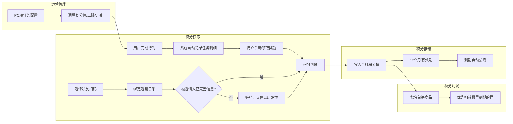

# 积分任务系统 · 产品需求文档

> **版本**：v1.0 &nbsp;|&nbsp; **负责人**：俊杰 &nbsp;|&nbsp; **更新**：2026-05-11 &nbsp;|&nbsp; **状态**：开发中

---

## 项目信息

| 字段 | 内容 |
|---|---|
| **产品名称** | 云芳邻 · 积分任务系统 |
| **版本定义** | v1.0 — 积分桶架构 + 任务引擎 + 前后端展示 |
| **核心目标** | 建立"赚积分-花积分"闭环，通过任务驱动用户活跃 |
| **关联文档** | 《积分运营方案》、FigJam 流程图（流程1-8） |

### 版本日志

| 版本 | 日期 | 修改内容 | 负责人 |
|---|---|---|---|
| v1.0 | 2026-04-24 | 初版发布：积分桶架构、任务引擎、C端/PC端功能、订阅消息、数据模型 | 俊杰 |
| v1.0 | 2026-05-09 | 内部评审后修订：任务叠加领取、积分数据统计页、订阅授权引导、赚积分页废弃、积分兑换社区限制、居民转账功能下线、任务优先级排序、积分桶规则补充 | 俊杰 |
| v1.0 | 2026-05-11 | 技术评审后修订：删除自动发放配置（统一走手动领取+周期重置兜底）、邀请好友页独立拆分、邀请奖励统计文案更新、红点改为定时轮询刷新、功能模块总览重构（分组+锚点跳转）、流程图同步更新 | 俊杰 |

---

## 需求背景

现有积分体系存在以下问题：

- 积分获取渠道单一（仅注册、邀新、参与活动），用户缺乏持续获取动力
- 积分无有效期，长期沉淀导致贬值风险
- 缺少统一的任务引擎，行为触发与积分发放逻辑散落在各业务模块
- 居民间积分转账（支付积分）存在合规风险，需下线该功能

---

## 需求目标

| 目标类型 | 描述 | 衡量指标 |
|---|---|---|
| **核心业务** | 建立积分月度桶 + 优先扣减最早到期积分 + 12个月有效期 | 积分过期回收率 |
| **用户活跃** | 通过任务系统驱动用户日常行为（发帖/点赞/浏览） | DAU提升、任务完成率 |
| **运营效率** | 后台统一管理任务参数（积分值、上限、开关），触发逻辑由开发预埋 | 任务参数调整即时生效 |
| **数据运营** | PC端积分数据统计，支持居民排行和商家核销两个维度 | 管理层可按社区/时间范围查看积分运营效果 |
| **合规安全** | 下线居民间积分转账功能，消除虚拟货币和无证支付风险 | 居民账户「支付积分」入口隐藏 |

---

## 业务流程总览

> 以下流程图展示积分任务系统的核心业务链路，用于评审时快速建立整体认知。

---

## 功能模块总览

| 分类 | 模块 | 端 | 功能点 |
|---|---|---|---|
| 底表与流程 | 积分桶 | 后端 | · [积分桶流入流出](#h-6-积分桶流入流出规则)：每月建桶，12个月有效期，优先扣减最早到期 · [过期清零](#h-7-积分桶过期清零规则)：每月1日定时清零到期桶 |
| 后端配置 | 任务配置 | PC端 | · [列表页](#h-1-列表页)：18条预置任务，上架/下架 · [编辑弹窗](#h-2-编辑弹窗)：触发逻辑只读+参数可编辑 · [预置任务清单](#h-3-预置任务清单)：12条本版本+6条下次版本 · [上线迁移规则](#h-4-上线迁移规则)：旧用户补建待领取记录 · [任务明细快照](#h-5-任务明细快照)：创建时冻结配置，不随后续修改变化 |
| 后端配置 | 任务明细 | PC端 | · [明细列表](#h-pc端-任务明细管理)：含周期重置时间、发放方式 · [详情弹窗](#h-2-详情弹窗)：任务快照+执行状态+关联用户 |
| 后端配置 | 积分数据 | PC端 | · [居民积分排行](#h-1-居民积分排行)：统计卡片+排行列表+时间范围筛选 · [商家核销排行](#h-2-商家核销排行)：统计卡片+排行列表+实时/范围字段区分 |
| 前端效果 | 任务中心 | C端 | · [页面结构](#h-1-页面结构)：蓝色卡片+白色内卡品字形（领券/兑换/邀请） · [任务卡片](#h-2-任务卡片)：4种状态优先级判定，支持叠加领取(N) · [列表规则](#h-3-列表规则)：排序+Tab筛选+异常边界 |
| 前端效果 | 我的账户 | C端 | · [过期积分提示条](#h-1-新增-过期积分提示条)：30天内即将过期提醒 · [赚积分入口](#h-2-新增-赚积分入口) / [邀请注册入口](#h-3-新增-邀请注册入口)：新增两个功能网格按钮 · [任务奖励流水记录](#h-4-新增-任务奖励流水记录)：流水标题格式和双方记录 · [隐藏支付积分](#h-5-隐藏-居民账户-支付积分-入口)：居民账户因合规风险下线 · [积分桶规则](#h-6-积分桶流入流出规则)：流入/流出/[过期清零](#h-7-积分桶过期清零规则) |
| 前端效果 | 积分兑换 | C端 | · [去赚积分按钮](#h-1-新增-去赚积分按钮)→任务中心 · [积分不足弹窗](#h-2-修改-积分不足弹窗)：双按钮改造 · [非本社区兑换拦截](#h-3-新增-非本社区居民兑换拦截)：社区校验优先于余额校验 |
| 前端效果 | 个人中心 | C端 | · [任务中心入口](#h-1-功能宫格-新增任务中心入口)：含[未领取奖励红点](#h-2-任务中心入口-未领取奖励红点) |
| 前端效果 | 赚积分 | C端 | · [废弃](#h-c端-赚积分页-废弃-)：由任务中心替代 |
| 前端效果 | 邀请好友 | C端 | · [邀请奖励发放节点](#h-1-邀请奖励发放节点调整)：扫码即发改为完善信息后发放 · [奖励统计文案](#h-2-奖励统计文案调整)：新增已完善人数 |
| 通知触达 | 订阅消息 | C端 | · [新增子开关](#h-1-新增子开关)：积分提醒（默认关闭） · [提醒规则](#h-2-提醒规则)：任务完成提醒+积分过期提醒 · [订阅授权引导](#h-3-订阅授权引导)：领取积分后判断总开关→子开关弹窗 |
| 权限 | [权限控制](#h-权限控制) | PC端 | · [菜单权限](#h-菜单权限)：任务管理仅超管，积分数据超管+社区管理员 · [数据权限](#h-数据权限)：按组织范围隔离 |
| 底表 | [数据模型](#h-数据模型) | 后端 | · [表结构总览](#h-表结构总览)：积分月度桶、桶扣减明细、任务配置、任务明细 · [字段值列表](#h-字段值列表)：状态/发放方式/上限周期等枚举值 |

---

## C端 · 任务中心页

<!-- prototype: src="prototype/task-center.html" width="375" height="812" scale="0.85" title="C端原型 · 任务中心" -->

#### 功能描述

### 1. 页面结构

- **积分主卡**（蓝色渐变圆角卡片，带白云装饰底纹）：
  - 上半部分：左上「我的积分」标签 + 积分总余额（大字号，数据来源为用户所有未过期积分之和），右上角「积分明细」文字入口（跳转【我的账户】页）
  - 下半部分：叠加一个白色内卡，内卡分为品字形三个区域：
    - 上排左：「领券中心」入口（图标+标题+副标题+箭头），点击跳转【领券中心】页
    - 上排右：「积分兑好物」入口（图标+标题+副标题+箭头），点击跳转【积分兑换】页，与左侧用竖线分隔
    - 下排通栏：邀请好友横幅（标题+积分数字高亮+「去邀请」按钮），与上排用横线分隔，点击跳转【邀请好友】页
- **Tab栏**（全部 / 待完成 / 已完成）：选中态加粗+蓝色下划线，向下滚动时吸顶固定，切换时前端筛选无需重新请求
- **任务卡片列表**：按状态排序展示；仅展示同时满足"已上架"且"在有效期内"的任务，下架或有效期过期任意满足即不展示

### 2. 任务卡片

#### ① 卡片结构

每张卡片由三部分组成：

- **左侧图标**：44x44px 圆形，浅色底+同色系深色描边图标，不同行为类型对应不同颜色，已完成状态统一置灰
- **中间内容区**：第一行为任务名称（16px加粗）+ 积分徽章（橙底圆角标签），第二行为任务说明文字（12px灰色）
- **右侧操作区**：操作按钮 + 周期进度文字（如"每日 1/3"）

#### ② 状态与交互

任务卡片有4种状态，按优先级判定（命中即停）：

| 优先级 | 按钮显示 | 判定条件 | 按钮样式 | 点击行为 |
|---|---|---|---|---|
| 1 |「领取奖励」/「领取奖励(N)」| 存在待领取明细 | 橙色填充 + 投影，置顶 | 一次性领取所有待领取明细，Toast "任务完成，获得 X 积分"；领取后按本表重新判定按钮状态 |
| 2 |「已达上限」| 无待领取，已领取次数 >= 上限（N>1） | 灰色填充，置灰沉底 | Toast "任务完成数已达上限" |
| 3 |「已完成」| 无待领取，已领取次数 >= 上限（N=1） | 灰色填充，置灰沉底 | Toast "任务完成数已达上限" |
| 4 |「去完成」| 无待领取，已领取次数 < 上限 | 蓝色填充 + 投影 | 跳转至[去完成跳转目标] |

**完成行为后的处理**：

- 用户完成一次行为，系统创建一条[待领取奖励]明细
- 用户无需先领取即可继续完成下一次，每次完成生成新的待领取明细
- 当前周期内总完成次数（已领取 + 待领取）达到上限后，不再创建新明细
- 无上限任务：不存在「已达上限」状态，按钮始终为「去完成」或「领取奖励」；周期进度显示为"无上限"，不显示分子分母

**周期重置（流程3处理）**：

- 下一周期开始时，将上一周期未领取的待领取明细自动发放为已领取，积分到账

#### ③ 周期进度

显示格式为"每日 1/3"、"每月 2/60"、"一次性 1/1"：

- **分母**：取自任务配置的[上限规则]中的次数（如"每日3次"则分母为3）
- **分子**：当前周期内状态为[已领取奖励]的记录数
- **变动时机**：用户点击「领取奖励」成功后分子增长，完成行为但未领取时分子不变

### 3. 列表规则

#### ① 排序

1. 待领取奖励（最前，引导用户立即领取）
2. 待完成（尚未完成行为的任务）
3. 已达上限 / 已完成（最后，置灰）

同级内按任务配置的序号排列。

#### ② Tab筛选

| Tab | 展示范围 |
|---|---|
| 全部 | 所有状态的任务 |
| 待完成 | 待领取奖励 + 有任务配置但用户还未完成的任务（可操作） |
| 已完成 | 已达上限 + 已完成，本周期已无法操作的任务 |

#### ③ 异常与边界

| 场景 | 处理方式 |
|---|---|
| 无任何任务 | 空状态插画 + 文案"暂无可用任务" |
| 网络异常 | Toast "网络异常，请稍后重试"，保留本地缓存列表 |
| 领取时积分写入失败 | Toast "领取失败，请重试"，状态不变 |
| 任务被后台下架 | 下次刷新时从列表消失，已领取的积分不受影响；已产生的待领取明细由定时任务自动发放 |
| 跳转链接为空 | 「去完成」按钮仍可点击，但不跳转，仅依赖行为触发自动完成 |

---

## C端 · 我的账户页

<!-- prototype: src="prototype/my-account.html" width="375" height="812" scale="0.85" title="C端原型 · 我的账户" -->

#### 本版本改动点

> **注意**：本版本基于现有【我的账户】页面，新增以下改动，其余功能和交互保持不变。

### 1. 新增：过期积分提示条

- **位置**：积分余额卡下方，功能网格区上方
- **文案格式**：`{即将过期积分数} 积分将于 {最近过期日期时间} 过期，请尽快使用`，过期时间精确到秒（如 2026-05-01 00:00:00）
- **显示条件**：当用户存在30天内即将过期的积分时显示，无则隐藏整个提示条
- **关闭交互**：右侧提供关闭按钮，点击后本次访问隐藏提示条，重新进入页面则恢复显示
- **数据来源**：查询用户未过期积分中过期时间在未来30天内的记录，汇总剩余总量
- 只展示总量，不展示每笔明细

### 2. 新增：赚积分入口

- **位置**：功能网格区，与现有的「收取积分」并列
- **点击跳转**：【任务中心】页面
- **展示条件**：常驻显示，无需后台配置

### 3. 新增：邀请注册入口

- **位置**：功能网格区，与「赚积分」并列
- **点击跳转**：【邀请好友】页面（复用现有邀请分享流程）
- **展示条件**：常驻显示

### 4. 新增：任务奖励流水记录

- 用户通过任务中心领取积分后，在明细列表中新增一条流水记录
- **标题格式**：`任务奖励-{任务名称}`（如"任务奖励-发布邻里帖子"）
- **金额**：正数，显示为 `+N`
- **时间**：领取奖励的时间
- 同样纳入月度收支汇总的"收入"统计
- **流水双方**：积分支出方为平台，收入方为用户；后台需对应生成一条平台支出流水和一条用户收入流水
- 过期清零记录标题为"积分过期清零"，金额为负数，附带说明"月度积分到期自动清零"

### 5. 隐藏：居民账户「支付积分」入口

- **位置**：功能网格区，原「支付积分」按钮
- **改动**：对居民账户隐藏该入口，不再展示
- **原因**：居民间积分转账存在合规风险（虚拟货币定性、无证支付、反洗钱），本版本下线该功能
- **保留**：「收取积分」入口保留，用于接收组织账户发放的积分
- **组织账户不受影响**：组织账户的「支付积分」和「收取积分」均保留

### 6. 积分桶流入流出规则

积分采用月度桶机制，每月一个桶，12个月有效期。所有积分变动通过桶进行管理。

#### ① 积分流入（收入）

用户获得积分时（任务奖励、邀请奖励、组织发放等），按以下规则写入桶：

1. 查询当月桶是否存在（如2026年5月桶）
2. 如果不存在：创建新桶，桶月份=当月，过期时间=创建月份+12个月的月末（如2026年5月桶的过期时间为2027年4月30日23:59:59），桶状态=正常
3. 如果已存在：直接累加到该桶
4. 写入对应的积分流水记录
5. 更新用户积分余额

#### ② 积分流出（支出）

用户消耗积分时（兑换商品等），优先从最早到期的桶开始扣减：

1. 按过期时间正序查询所有状态为正常且剩余积分 > 0 的桶
2. 从最早到期的桶开始扣减，扣减额 = min（本桶剩余，待扣总额）
3. 记录桶扣减明细（关联流水ID、桶ID、扣减数量）
4. 如果当前桶扣完仍不够，继续扣下一个桶，直到扣完或所有桶扣光
5. 如果所有桶的剩余积分之和 < 待扣总额，拒绝本次消费
6. 更新用户积分余额

### 7. 积分桶过期清零规则

每月1日00:00定时触发，扫描并清零到期的积分桶：

1. 筛选条件：桶状态=正常 且 过期时间 < 当前时间
2. 遍历每个到期桶：
   - 桶剩余积分 > 0：写一条积分过期流水（变动类型=过期清零，支出方=用户，收入方=平台回收账户，变动额=本桶剩余），写桶操作明细，桶状态更新为已过期
   - 桶剩余积分 = 0：仅更新桶状态为已过期，不写流水不写桶明细
3. 更新受影响用户的积分余额（余额 = 所有正常状态桶的剩余可用之和）

---

## C端 · 积分兑换页

<!-- prototype: src="prototype/points-exchange.html" width="375" height="812" scale="0.85" title="C端原型 · 积分兑换" -->

#### 本版本改动点

> **注意**：本版本基于现有【积分兑换】页面，新增以下改动，其余功能保持不变。

### 1. 新增：去赚积分按钮

- **位置**：积分余额数字右侧
- **点击跳转**：【任务中心】页面
- **展示条件**：常驻显示

### 2. 修改：积分不足弹窗

- **触发条件**：用户点击「兑换」按钮时，当前积分余额小于商品所需积分
- **弹窗文案**：「您的积分不够，先去赚积分吧」
- **按钮改动**：原弹窗底部仅有「我知道了」单按钮，改为双按钮「取消」+「去赚积分」
  - 「取消」：关闭弹窗，返回兑换列表
  - 「去赚积分」：关闭弹窗并跳转【任务中心】页面

### 3. 新增：非本社区居民兑换拦截

- **触发条件**：用户点击「兑换」按钮时，用户[所属社区]与商品[所属社区]不一致
- **判断优先级**：社区校验优先于积分余额校验（先判社区再判余额）
- **弹窗设计**：
  - 标题：该物品仅限本社区居民兑换
  - 文案：您不属于该社区，无法兑换此商品，可前往领券中心领取优惠券
  - 按钮：「去领券中心」+「知道了」
    - 「去领券中心」：关闭弹窗并跳转【领券中心】页面
    - 「知道了」：关闭弹窗，返回兑换列表

---

## C端 · 个人中心页

<!-- prototype: src="prototype/my-profile.html" width="375" height="812" scale="0.85" title="C端原型 · 个人中心" -->

#### 本版本改动点

> **注意**：本版本基于现有【个人中心】页面，新增以下改动，其余功能和交互保持不变。

### 1. 功能宫格：新增任务中心入口

- **位置**：功能宫格区，新增一个入口项
- **图标**：蓝色勾选清单样式（与任务概念关联）
- **文案**：任务中心
- **点击跳转**：【任务中心】页面
- **展示条件**：常驻显示

### 2. 任务中心入口：未领取奖励红点

- **位置**：任务中心 icon 右上角，圆形小红点（无数字）
- **展示条件**：当前用户存在任意一条状态为「待领取奖励」的任务明细记录
- **消失条件**：用户领取全部「待领取奖励」明细
- **持续逻辑**：除「领取奖励」操作外，时间流逝、页面切换、APP 重启等均不会清除红点
- **数据来源**：个人中心页设置定时轮询（如每30秒），持续查询当前用户是否存在状态为「待领取奖励」的任务明细记录，实时更新红点状态

---

## C端 · 赚积分页（废弃）

<!-- prototype: src="prototype/earn-points.html" width="375" height="812" scale="0.85" title="C端原型 · 赚积分页（废弃）" -->

> **本版本废弃此页面**。原有的赚积分功能由【任务中心】页面替代，所有原指向赚积分页的入口改为跳转【任务中心】。邀请功能由任务中心的邀请横幅和我的账户的邀请注册按钮承接，跳转目标为现有【邀请好友】页。

---

## C端 · 邀请好友页

<!-- prototype: src="prototype/invite.html" width="375" height="812" scale="0.85" title="C端原型 · 邀请好友" -->

#### 本版本改动点

> **注意**：本版本基于现有【邀请好友】页面，新增以下改动，其余功能和交互保持不变。

### 1. 邀请奖励发放节点调整

- **核心变更**：邀请奖励发放节点从「扫码即发」改为「完善个人信息后发放」
- **发放判断有两个入口**，任一入口满足条件即发放：

**入口一：用户扫描邀请码**

用户扫描邀请码，判断该用户的[被邀请码]是否已有值：
- 如果已有值，说明之前已绑定过邀请关系，不做任何处理，流程结束
- 如果没有值，写入[被邀请码]并填充[所属社区]，然后判断该用户是否已完善个人信息：
  - 如果已完善，发放双方各 50 积分
  - 如果未完善，不发放，等待用户完善信息时再触发

**入口二：用户完善个人信息**

用户完善个人信息成功后（一次性动作，完善即全部必填项保存），判断该用户的[被邀请码]是否有值：
- 如果无值，说明没有邀请关系，不发放，流程结束
- 如果有值，发放双方各 50 积分

### 2. 奖励统计文案调整

- **展示位置**：页面底部"奖励统计"区域
- **现有文案**：已邀请 X 人，已赚取 X 积分
- **改为**：共邀请 X 人（已完善信息 X 人）得 X 积分
- **统计口径**：
  - 共X人：[被邀请码]等于当前用户邀请码的用户数
  - 已完善X人：上述用户中已完善个人信息的数量
  - 得X积分：邀请奖励类型的积分流水合计

---

## PC端 · 任务配置管理

<!-- prototype: src="prototype/task-config.html" width="1920" height="1080" scale="0.35" title="PC端原型 · 任务配置列表" -->

#### 设计原则

任务触发逻辑由开发预埋（每条任务对应一个系统内置的行为事件），运营后台仅负责调整参数和管理开关。系统初始化时写入全部预置任务，不支持新增或删除。

#### 功能描述

### 1. 列表页

- **筛选区**：支持按[任务名称]（模糊搜索，同时匹配行为类型标签和任务名称）、[上架状态]（下拉：全部/已上架/已下架）组合筛选
- **表格列**：

| 列名 | 说明 |
|---|---|
| [序号] | 自增序号 |
| [行为类型] | 语义标签（如"浏览信息公开"），系统预置不可修改 |
| [任务名称] | 运营可编辑的C端展示文案 |
| [任务描述] | 运营可编辑的C端展示描述，溢出省略 |
| [积分值] | 数值显示 |
| [上限规则] | 显示为"每日 3次"格式，无上限则显示"无上限" |
| [有效期] | 永久 或 起止时间范围（如 2026-05-01 ~ 2026-06-30） |
| [上架状态] | 标签样式：已上架(绿)、已下架(灰) |
| [操作] |「编辑」「上架/下架」 |

- **行内操作**：
  - 「编辑」：打开编辑任务配置弹窗
  - 「上架/下架」：弹出二次确认弹窗，确认后执行
    - 下架确认：标题"确认下架此任务？"，警告图标（橙色三角），说明文案"下架后，C端用户将无法在页面中看到该任务。但已被用户接取的任务明细，在有效期内仍可正常完成和领取。"，按钮「取消」+「确定下架」
    - 上架确认：标题"确认上架此任务？"，信息图标（蓝色圆圈），说明文案"上架后任务将对C端用户可见，用户可在任务中心看到并完成该任务。"，按钮「取消」+「确定上架」
- **无分页**：共18条预置任务，单页展示全部

### 2. 编辑弹窗

弹窗标题固定为"编辑任务配置"，分为只读区和可编辑区：

**只读信息区**：

| 字段 | 说明 |
|---|---|
| [行为类型] | 语义化标签（如"浏览信息公开"、"邻里圈发帖"），系统预置不可修改，结合功能模块和行为自动生成 |
| [触发逻辑] | 在[行为类型]下方以灰色小字展示该任务的系统触发方式，每个行为类型对应一条固定文案（取自预置任务清单的[触发条件]列），只读不可编辑 |

**可编辑参数区**：

| 字段 | 控件类型 | 规则说明 |
|---|---|---|
| [任务名称] | 文本输入 | 必填，最多20字，C端任务卡片主标题 |
| [任务描述] | 文本域 | 选填，最多100字，C端任务卡片描述行 |
| [积分值] | 数字输入 + "积分"后缀 | 必填，根据任务类型动态提示建议范围：常规任务 1 ~ 10；超出范围红色警告但允许保存 |
| [上限规则] | 勾选"无上限" 或 周期下拉 + 次数输入 | 周期选项：每日/每周/每月/仅；勾选无上限时禁用周期和次数输入 |
| [有效期] | 单选组（永久/限时） | 选择限时时展开起止时间选择器 |
| [是否上架] | 开关 | 上架后任务对C端用户可见 |

- 点击「保存」更新参数，即时生效，显示保存成功提示
- 点击「取消」关闭弹窗，不保存修改
- 参数修改只影响未来新产生的任务明细，已完成的明细和已发放的积分不受影响

### 3. 预置任务清单

以下18条任务由系统初始化时写入，涵盖平台所有可积分行为：

| 序号 | 优先级 | 行为类型（语义标签） | 默认任务名称 | 默认任务描述 | 默认积分值 | 计算单位 | 默认上限规则 | 触发条件 | 去完成跳转目标 | 积分规则说明 |
|---|---|---|---|---|---|---|---|---|---|---|
| 1 | 本版本 | 浏览信息公开 | 浏览信息公开资讯 | 浏览信息公开模块下的资讯内容即可获得积分 | 1 | 单次 | 每日 3次 | 用户点开信息公开模块下任意子入口即触发，涵盖：【党组织】【居委会】【党务公开】【居务公开】【社区公告】【社区公约】【费用公开】【政策通知】 | 【信息公开】模块首页 | 不区分社区 |
| 2 | 本版本 | 浏览社区宣传 | 浏览社区宣传资讯 | 浏览社区宣传模块下的资讯内容即可获得积分 | 1 | 单次 | 每日 3次 | 用户点开社区宣传模块下任意子入口即触发，涵盖：【社区风貌】【风采视频】【社区生活圈】【风采报道】 | 【社区宣传】模块首页 | 不区分社区 |
| 3 | 本版本 | 分享社区活动 | 分享社区活动 | 将社区活动分享给微信好友或微信群，助力社区传播 | 1 | 单次 | 每日 4次 | 用户在活动详情页点击微信分享按钮（上滑面板）即触发，通过微信分享组件监控 | 【社区活动】列表页 | - |
| 4 | 本版本 | 分享志愿服务 | 分享志愿服务 | 将志愿服务分享给微信好友或微信群，传递正能量 | 1 | 单次 | 每日 3次 | 用户在志愿服务详情页点击微信分享按钮（上滑面板）即触发，通过微信分享组件监控 | 【志愿服务】列表页 | - |
| 5 | 本版本 | 提交问卷 | 填写调查问卷 | 认真填写社区问卷调查，帮助社区了解居民需求 | 2 | 单次 | 每日 3次 | 用户成功提交一份问卷 | 【调查问卷】列表页 | 不限制居民社区 |
| 6 | 本版本 | 成为社区达人 | 成为社区达人 | 申请成为社区达人，居委审核通过即可获得积分 | 5 | 单个 | 仅 1次 | 用户提交社区达人申请且居委审核通过 | 【社区达人】申请页 | 仅首次申请审核通过可得 |
| 7 | 本版本 | 创建社团 | 创建社区社团 | 发起创建社区社团，居委审核通过即可获得积分 | 8 | 单个 | 仅 1次 | 用户提交社团创建申请且居委审核通过 | 【社团】创建页 | 同个社团仅首次申请通过可得 |
| 8 | 本版本 | 加入社团 | 加入社区社团 | 加入感兴趣的社区社团，结识志同道合的邻居 | 2 | 单个 | 每日 5次 | 用户成功加入一个社区社团 | 【社团】列表页 | 同一居民加入同一社团仅首次可得 |
| 9 | 本版本 | 浏览周边好店 | 浏览周边好店 | 浏览周边好店商家详情即可获得积分 | 1 | 单个 | 每日 10次 | 用户点开好店的商家入口即触发 | 【周边好店】列表页 | 同一店铺当日仅首次可得 |
| 10 | 本版本 | 分享周边好店 | 分享周边好店 | 将周边好店分享给微信好友或微信群 | 1 | 单次 | 每日 10次 | 用户将周边好店分享至微信好友或微信群 | 【周边好店】列表页 | - |
| 11 | 本版本 | 完善个人信息 | 完善个人信息 | 将个人信息所有必填项全部完善即可获得积分 | 5 | 单次 | 仅 1次 | 用户在个人信息页成功提交完善信息的节点触发 | 【个人信息】编辑页 | 旧用户上线迁移时补建待领取记录 |
| 12 | 本版本 | 开启消息订阅 | 开启消息订阅通知 | 开启消息订阅通知，及时接收社区动态 | 5 | 单次 | 仅 1次 | 用户在消息订阅配置页开启总开关并成功完成微信统一授权 | 【消息订阅设置】页 | 关闭后再次开启不可重复获得 |
| 13 | 下次版本 | 参与投票 | 参与社区投票 | 积极参与社区投票，为社区事务贡献你的一票 | 1 | 单次 | 每日 5次 | 用户成功完成一次投票 | 【社区投票】列表页 | 不限制居民社区 |
| 14 | 下次版本 | 金点子公示 | 金点子被公示 | 提交的金点子被居委公示即可获得积分奖励 | 2 | 单条 | 无上限 | 居民提交的金点子被居委公示 | 【金点子】提交页 | 不限制社区 |
| 15 | 下次版本 | 邻里圈发帖 | 发布邻里圈帖子 | 在邻里圈发布帖子，分享生活点滴 | 2 | 单条 | 每日 3条 | 用户在邻里圈成功发布帖子 | 【邻里圈】发帖页 | 编辑后重新发布不可重复得分 |
| 16 | 下次版本 | 邻里圈点赞 | 点赞邻里圈帖子 | 为邻居的帖子点赞，传递社区温暖 | 1 | 单次 | 每日 3次 | 用户点赞一条帖子 | 【邻里圈】信息流首页 | - |
| 17 | 下次版本 | 发布租赁信息 | 发布租赁信息 | 发布房屋或车位租赁信息，居委审核通过即可获得积分 | 1 | 单条 | 无上限 | 用户发布租赁信息且居委审核通过 | 【租赁信息】发布页 | - |
| 18 | 下次版本 | 发布招聘信息 | 发布人才招聘 | 发布人才招聘信息，居委审核通过即可获得积分 | 1 | 单条 | 无上限 | 用户发布招聘信息且居委审核通过 | 【人才招聘】发布页 | - |

> **跳转目标性质**：与[行为类型]一样系统预置不可修改，运营在【任务配置】页不可编辑。

### 4. 上线迁移规则

系统上线时，对以下一次性任务，为已满足条件的旧用户自动补建一条状态为[待领取奖励]的任务明细记录：

| 任务 | 筛选条件 | 迁移动作 |
|---|---|---|
| 完善个人信息 | 用户个人信息所有必填项已填写完成 | 创建一条待领取奖励记录（5积分） |
| 开启消息订阅 | 用户消息订阅总开关已开启 | 创建一条待领取奖励记录（5积分） |

- 迁移为一次性操作，仅在系统上线时执行
- 创建的记录与正常完成任务的记录一致，用户在任务中心可见并手动领取
- 个人中心红点提示生效，引导旧用户首次进入任务中心体验领取流程

### 5. 任务明细快照

每条任务明细创建时，冻结当时的任务配置信息作为快照，后续配置修改不影响已产生的明细。

快照保留以下字段：
- [任务名称]
- [任务描述]
- [积分值]
- [上限规则]

注：[行为类型]为系统预置不可修改，无需快照，直接从任务配置表读取。

快照用途：
- PC端任务明细详情弹窗展示快照数据，而非当前配置
- 积分发放金额以快照中的[积分值]为准，不随后续配置调整变化

---

## PC端 · 任务明细管理

<!-- prototype: src="prototype/task-detail-page.html" width="1920" height="1080" scale="0.35" title="PC端原型 · 任务明细列表" -->

#### 功能描述

### 1. 列表页

- **筛选区**：支持按[任务名称]（文本模糊搜索）、[所属社区]（下拉选择）、[用户姓名]（文本搜索）、[手机号]（文本搜索）、[状态]（下拉：全部/待领取奖励/已领取奖励）、[完成时间]（日期范围）组合筛选
- **操作栏**：「导出Excel」— 按当前筛选条件导出，包含全部列表字段
- **表格列**：

| 列名 | 说明 |
|---|---|
| [ID] | 明细记录ID |
| [任务名称] | 来自快照 |
| [所属社区] | 用户所属社区 |
| [用户姓名] | 用户姓名 |
| [手机号] | 脱敏显示（如138****5678） |
| [积分值] | 来自快照 |
| [状态] | 标签样式：待领取奖励(橙)、已领取奖励(绿) |
| [完成时间] | 行为触发时间，格式 YYYY-MM-DD HH:mm:ss |
| [领取时间] | 手动领取或自动发放的时间，待领取显示"-"，格式同上 |
| [发放方式] | 手动（用户点击领取）/ 自动（周期重置时系统兜底发放），待领取显示"-" |
| [周期重置时间] | 当前周期的截止时间（如每日任务显示当日23:59:59），一次性任务显示"-" |
| [操作] |「详情」链接 |

- **行内操作**：
  - 「详情」：打开任务明细详情弹窗
- **分页**：默认每页20条

### 2. 详情弹窗

弹窗标题行：「任务明细详情」

内容分为三个区块，以蓝色 bar 标题分隔：

**任务快照**（灰底圆角卡片）
- [行为类型]、[任务名称]
- [积分值]、[上限规则]
- [任务描述]（独占一行，多行文本）
- 快照数据来自明细创建时冻结的配置，与当前任务配置可能不一致
- [行为类型]从任务配置表直接读取（不入快照，不可修改）

**执行状态**
- [状态]：标签样式与列表页一致（待领取奖励 橙 / 已领取奖励 绿），与 [发放方式] 同行
- [完成时间]：行为触发的时间，格式 YYYY-MM-DD HH:mm:ss，与 [领取时间] 同行
- [领取时间]：手动领取或自动发放的时间，待领取显示"-"
- [发放方式]：手动 / 自动，待领取显示"-"

**关联用户**
- [所属社区]、[用户姓名]、[手机号]（脱敏显示），同行排列

---

## PC端 · 积分数据

<!-- prototype: src="prototype/points-data.html" width="1920" height="1080" scale="0.35" title="PC端原型 · 积分数据" -->

#### 功能描述

在数据看板主菜单下新增"积分数据"页，与"用户数据"并列。左侧复用组织树状菜单，按社区/街道维度筛选，统计卡片和列表跟随联动。页面通过 Tab 切换居民和商家两个维度。

### 1. 居民积分排行

#### ① 统计卡片

| 卡片 | 数据 | 跟随时间范围 |
|---|---|---|
| 累计获取积分 | 总获取量 | 是 |
| 累计消耗积分 | 所有积分支出总和 | 是 |
| 活跃用户数 | 有积分变动的用户数 | 是 |
| 即将过期积分 | 30天内即将过期积分总量，卡片下方显示最近一笔过期时间 | 否 |

每张卡片标题右侧带叹号图标，鼠标悬停显示气泡说明统计逻辑。

#### ② 列表

- **筛选区**：支持按[时间范围]（日期范围选择器，精确到天，默认当月1日至今日）、[用户姓名]（文本搜索）、[手机号]（文本搜索）组合筛选
- **操作栏**：「导出Excel」— 按当前筛选+排序条件导出，文件名带时间范围（如"居民积分排行_20260301-20260508.xlsx"）
- **表格列**：

| 列名 | 说明 |
|---|---|
| [排名] | 行号，跟随当前排序结果自动编号 |
| [用户姓名] | - |
| [手机号] | 脱敏显示 |
| [所属社区] | - |
| [累计获取] | 选定范围内积分收入总和，支持排序 |
| [累计消耗] | 选定范围内积分支出总和，支持排序 |
| [当前余额（实时）] | 未过期积分，支持排序，不受时间范围影响 |
| [即将过期（实时）] | 30天内即将过期的积分量，不受时间范围影响 |
| [操作] |「详情」「查看流水」 |

- **行内操作**：
  - 「详情」：打开居民详情弹窗
  - 「查看流水」：跳转积分流水页并自动带入该用户的筛选条件
- **排序交互**：可排序列的列头带排序图标，点击切换排序维度（始终降序，不支持升序切换），当前排序列高亮；默认按[累计获取]降序；同值时按用户ID正序兜底
- **分页**：默认每页20条

### 2. 商家核销排行

#### ① 统计卡片

| 卡片 | 数据 | 跟随时间范围 |
|---|---|---|
| 累计核销积分 | 核销积分总量 | 是 |
| 累计核销笔数 | 核销订单数 | 是 |
| 活跃商家数 | 有核销记录的商家去重数 | 是 |

每张卡片标题右侧带叹号图标，鼠标悬停显示气泡说明统计逻辑。

#### ② 列表

- **筛选区**：支持按[时间范围]（日期范围选择器，精确到天，默认当月1日至今日）、[商家名称]（文本搜索）组合筛选
- **操作栏**：「导出Excel」— 按当前筛选+排序条件导出，文件名带时间范围
- **表格列**：

| 列名 | 说明 |
|---|---|
| [排名] | 行号，跟随当前排序结果自动编号 |
| [商家名称] | - |
| [所属社区] | - |
| [累计核销积分] | 选定范围内核销积分总量，支持排序 |
| [核销笔数] | 选定范围内核销订单数，支持排序 |
| [本月核销（实时）] | 当月核销积分，不受时间范围影响，支持排序 |
| [本月笔数（实时）] | 当月核销订单数，不受时间范围影响，支持排序 |
| [操作] |「详情」 |

- **行内操作**：
  - 「详情」：打开商家详情弹窗
- **排序交互**：同居民排行，默认按[累计核销积分]降序；同值时按商家ID正序兜底
- **分页**：默认每页20条

---

## 订阅消息

<!-- prototype: src="prototype/notification-settings.html" width="375" height="812" scale="0.85" title="C端原型 · 消息订阅设置" -->

#### 功能描述

复用云芳邻已有的微信长期订阅消息能力（总开关 + 业务子开关 + 统一长期订阅模板），本版本新增「积分提醒」业务子开关，覆盖 2 类通知场景：任务完成提醒、积分过期提醒。

### 1. 新增子开关

- **位置**：【消息订阅设置】页，业务子开关分类下
- **名称**：积分提醒（2 项）
- **默认状态**：上线时默认关闭，需用户通过授权引导或手动进入设置页开启
- **关闭后**：不再向该用户推送积分相关通知，已开启的微信总开关授权不受影响
- **子项**：【积分提醒】任务完成提醒、【积分提醒】积分过期提醒

### 2. 提醒规则

#### ① 任务完成提醒

**触发事件**

用户在业务页面完成行为，系统命中某条任务的触发条件并创建任务明细（状态为「待领取奖励」），即触发推送。

**模板字段填充**

| 字段 | 内容 |
|---|---|
| 社区通知 | 任务完成提醒 |
| 通知内容 | 您完成了「{任务名称}」，{积分值} 积分待领取 |
| 通知时间 | 取任务明细的 [完成时间] 字段，格式 YYYY-MM-DD HH:mm |
| 提示说明 | 点击进入任务中心立即领取 |

> 模板字段中 `{任务名称}`、`{积分值}` 取自该条明细的快照数据，不随后续任务配置变化。

**落地页**

用户点击订阅消息卡片 → 跳转【任务中心】页面，由用户点击对应卡片的「领取奖励」按钮完成领取。

**频次控制**

- 同一用户一小时内最多收到 1 条任务完成提醒
- 以用户最近一次收到该类推送的时间为起点，窗口内新产生的「待领取奖励」明细静默跳过，不排队不补发
- 窗口内第一条命中的任务决定推送文案

#### ② 积分过期提醒

**触发事件**

系统每日定时检查（可复用流程5积分桶过期清零的定时任务），当用户存在 30 天内即将过期的积分时触发。

**模板字段填充**

| 字段 | 内容 |
|---|---|
| 社区通知 | 积分过期提醒 |
| 通知内容 | 您有 {即将过期积分数} 积分将于 {最近过期日期时间} 过期，请尽快使用 |
| 通知时间 | 提醒发送时间，格式 YYYY-MM-DD HH:mm |
| 提示说明 | 点击查看积分明细 |

> `{即将过期积分数}` 和 `{最近过期日期时间}` 的数据来源与【我的账户页 - 1. 过期积分提示条】一致，查询用户未过期积分中过期时间在未来 30 天内的记录汇总。

**落地页**

用户点击订阅消息卡片 → 跳转【我的账户】页面，查看积分余额并消费。

**频次控制**

- 同一批过期积分推送 2 次：过期前 30 天推送第 1 次，过期前 3 天推送最后 1 次
- 已推送过的批次不重复推送（以积分桶月份 + 用户为去重维度）

### 3. 订阅授权引导

**触发场景**：用户在任务中心领取积分成功后

**默认状态**：积分提醒两个子开关上线时默认关闭，需用户主动开启

**流程**：

用户领取积分成功后，按以下顺序判断：

1. 判断消息订阅总开关是否已开启：
   - 未开启 → 弹出**总开关引导弹窗**
   - 已开启 → 进入第2步
2. 判断「积分提醒」下的两个子开关是否全部关闭：
   - 至少一个已开启 → 不弹窗，正常结束
   - 两个都关闭 → 弹出**子开关引导弹窗**

两种弹窗的用户操作一致：
- 点击「确认」：跳转【消息订阅设置】页，用户自行操作（打开总开关时会同步开启所有子开关）
- 点击「取消」：关闭弹窗，返回【任务中心】页面

**弹窗设计**（复用现有订阅引导弹窗样式）：

- 总开关引导弹窗：
  - 标题：领取成功！
  - 副标题：是否订阅【社区通知订阅】
  - 文案：开启消息订阅，及时接收社区动态和积分变动提醒
  - 按钮：「取消」+「确认」
- 子开关引导弹窗：
  - 标题：领取成功！
  - 副标题：是否开启【积分提醒】
  - 文案：开启后可收到任务完成和积分过期提醒，不错过每一笔积分
  - 按钮：「取消」+「确认」

**防打扰规则**：

- 同一用户每天最多弹出一次

---

## 权限控制

### 菜单权限

| 菜单项 | 开放角色 | 说明 |
|---|---|---|
| 任务管理 > 任务配置 | 超级管理员 | 任务为预置种子数据，涉及全局积分策略，仅超管可编辑配置和上下架 |
| 任务管理 > 任务明细 | 超级管理员 | 查看全平台用户的任务完成和积分发放明细 |
| 数据看板 > 积分数据 | 超级管理员、社区管理员 | 查看积分统计数据，数据范围受组织权限控制 |

非超管角色在侧边栏中不显示「任务管理」菜单组。

### 数据权限

- **任务管理**：当前版本任务统一由平台配置、平台出资，操作者仅为超级管理员，数据权限范围为全平台
- **积分数据**：超级管理员可查看全平台数据；社区管理员仅可查看其所属组织范围内的居民和商家数据，左侧组织树根据当前用户的组织归属自动过滤

### 功能权限

当前版本不做功能级别的细粒度权限控制，超管拥有全部操作权限（编辑配置、上架/下架、查看明细、导出）。

---

## 核心业务流程

完整流程图见 FigJam 文件。

| 流程编号 | 名称 | 触发方式 |
|---|---|---|
| 流程1 | 任务中心展示逻辑 | 用户打开任务中心 |
| 流程2 | 任务触发流程 | 用户行为事件 |
| 流程3 | 每日定时更新 | 每日00:00定时 |
| 流程4 | 积分桶流入流出（自身变动） | 积分收入或支出时 |
| ~~流程4-1~~ | ~~积分转账流程（C2C，过期时间继承）~~ | ~~废弃：居民间转账功能因合规风险下线~~ |
| 流程5 | 积分桶过期清零 | 每月1日定时 |
| 流程6 | 用户领取任务奖励 | 用户点击领取 / 周期重置自动发放 |
| 流程7 | 老用户存量迁移 | 系统更新时一次性 |

---

## 数据模型

### 表结构总览

| 表名 | 用途 | 关键字段 |
|---|---|---|
| 积分月度桶 | 每月一个桶，记录积分余额和过期时间 | 用户ID、桶月份、剩余积分、过期时间、状态 |
| 桶扣减明细 | 记录每次积分消耗的扣减来源 | 流水ID、桶ID、扣减数量 |
| 任务配置 | 预置种子数据，18条系统初始化写入 | 功能模块、任务名称、行为类型、触发事件、积分值、计算单位、上限周期、上限次数、是否上架 |
| 任务明细 | 每次行为触发创建一条记录 | 用户ID、任务配置ID、配置快照、周期计数、状态 |

### 字段值列表

**任务明细**

| 字段 | 取值 |
|---|---|
| [状态] | · 待领取奖励：行为已触发，等待手动领取 · 已领取奖励：积分已发放到账 |
| [发放方式] | · 手动：用户点击「领取奖励」 · 自动：周期重置时系统兜底发放 |

**任务配置**

| 字段 | 取值 |
|---|---|
| [上架状态] | · 已上架：C端可见 · 已下架：C端不可见，已产生的明细不受影响 |
| [上限周期] | · 每日：00:00 重置 · 每周：周一 00:00 重置 · 每月：1 日 00:00 重置 · 仅1次：完成后永久不可再得 · 无上限：不限次数 |
| [计算单位] | · 单次 / 单条 / 单个（展示用，不影响逻辑） |
| [有效期] | · 永久：任务长期有效 · 限时：需配置起止时间 |

**积分月度桶**

| 字段 | 取值 |
|---|---|
| [状态] | · 正常：未过期，可扣减 · 已过期：定时任务标记，剩余积分清零 |
